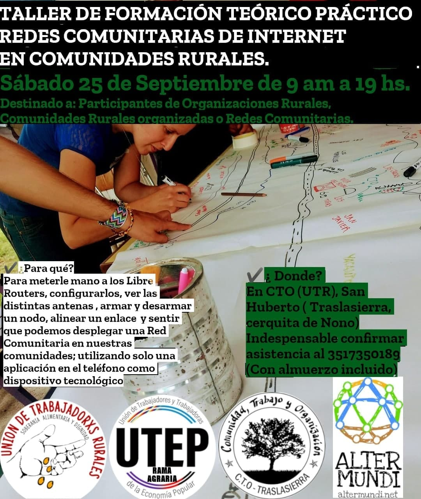
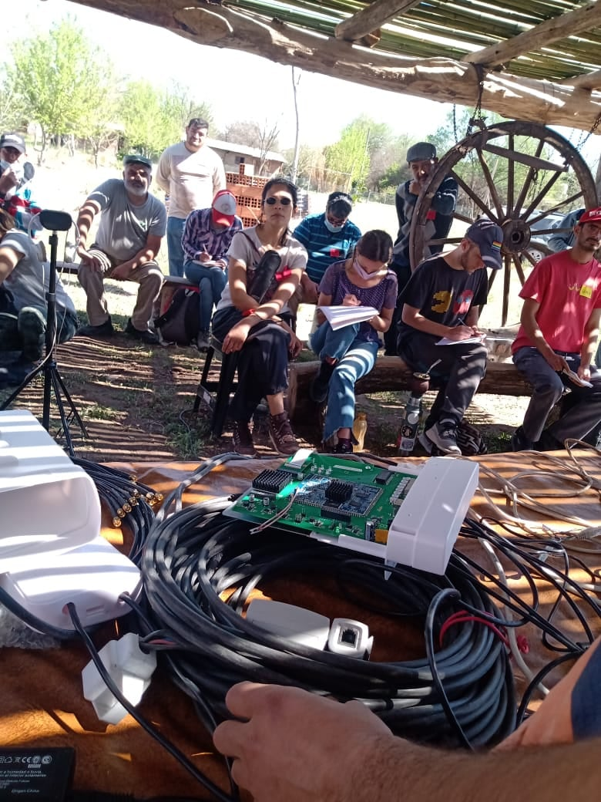
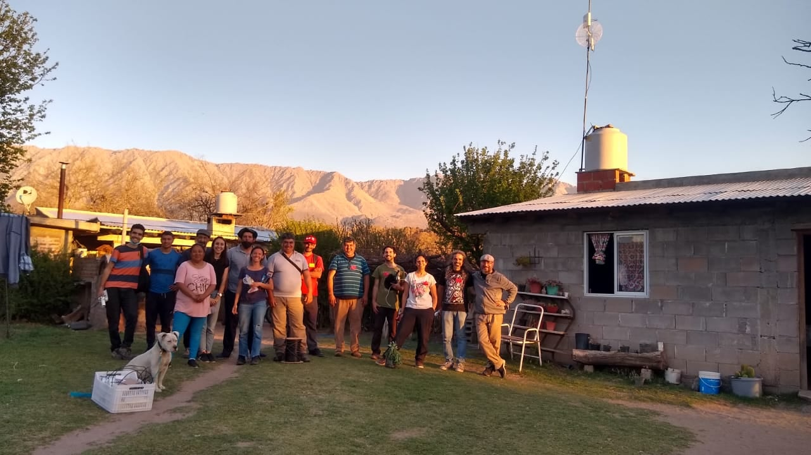
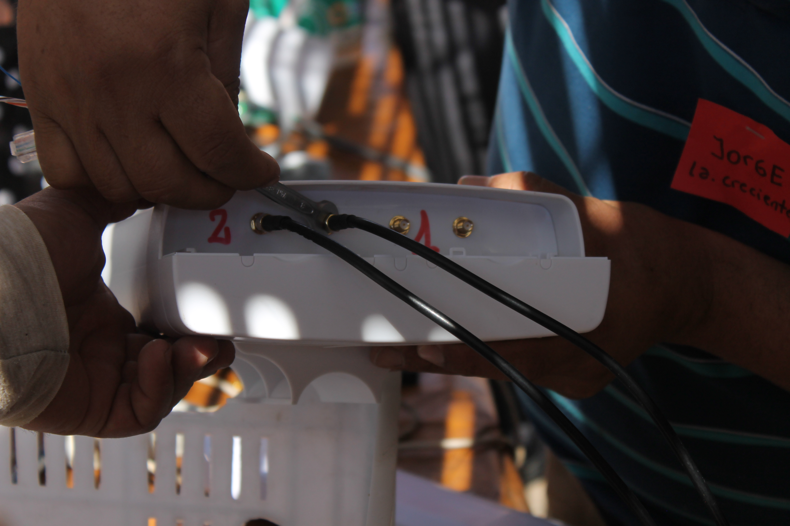
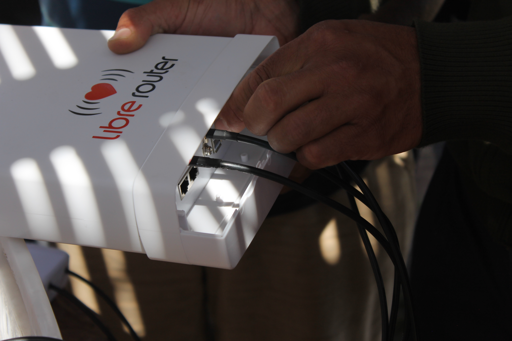

# Redes Rurales Digitales

Facultad de Agronomía y Veterinaria  
Universidad Nacional de Río Cuarto 

[Enlighten Your Research
BELLA](https://www.redclara.net/index.php/es/noticiasyeventos/noticias/2339-enlighten-your-research-bella-impulsando-la-cooperacion-internacional-en-investigacion-con-redclara-y-geant)   
21 de enero 2022  
*Daniel Bellomo*

# Agenda

- ¿Quienes somos?
- ¿Qué hacemos?
- ¿Con quienes trabajamos?
- ¿Qué necesitamos?

# ¿Quienes somos?
- [Facultad de Agronomía y Veterinaria](http://www.ayv.unrc.edu.ar)  
- [Universidad Nacional de Río Cuarto](https://unrc.edu.ar)

# Redes digitales rurales

- Redes Comunitarias (mesh)
- Redes LPWAN

# Campos
- Campo Pozo del Carril, La Aguada
- [Campo Las Guindas, Las Lagunitas](https://umap.openstreetmap.fr/en/map/las_lagunitas_702476)

Note:
la uni tiene 2 campos, voy a centrarme Las Guindas

# 
- Agronomía y Veterinaria
- Biología
- Geológia

# ICBIA 
- Instituto de Ciencias de la Tierra, Biodiversidad y Ambiente (UNRC - CONICET) 
- relevamiento geológico 
- estudios científicos del comportamiento de cámaras magmáticas
- cooperación con UNLP y Univ. País Vasco
- construcción de un albergue (proyecto)
- generar escuelas de campo para profesionales y alumnos otras universidades

Estas investigaciones a su vez, se encuentran en el marco de un proyecto marco del ICBIA, que tiene por finalidad cartografiar los rescursos naturales disponibles en la región y gestionar un aprovechamiento sustentables de los mismos, para el beneficio de las comunidades que la habitan.

# Red Comunitaria
- Roberto Arias [ENACOM](https://www.enacom.gob.ar)
- [Red mesh](red_mesh.html)
- [LibreRouter](https://librerouter.org)

Note:
RA: contar
LR: HW y SL diseñado para RC

# Capacitaciones de la comunidad

#

#

#

#

#

# ¿Con quienes trabajamos?

- [AlterMundi](https://altermundi.net)
- [Tecnología de Raiz](TdR.html)
- [IEEE Argentina](http://ieee.org.ar)
- [Ascentio](https://www.ascentio.com.ar)
- [Hacking Ecology](https://hackingecology.com)
- [The Things Network](https://www.thethingsnetwork.org)
- [IoTCSLAC: SubGT LPWAN y Redes Abiertas](IoTCS.html)
- [Comunidad del paraje Las Lagunitas (Cba)](https://chocancharava.libre.org.ar/las_lagunitas/)
- [FLISoL](https://flisol.info)
- [Cátedra Libre de Soberanía Tecnológica](https://clistec.libre.org.ar)

# ¿Qué necesitamos?
- Colaboración con expertos/as
- Vincularnos con instituciones para que realicen pruebas de campo de sus
  desarrollos
- Tier1 para [ElRepo.io](https://elrepo.io)
- Grupos de R&D en antenas (TdR)
- Server para RDR (sensores)
- Sistema de [mensajería](https://meshtastic.org)
- Server para [NAWA](nawa.html) (matrix)
